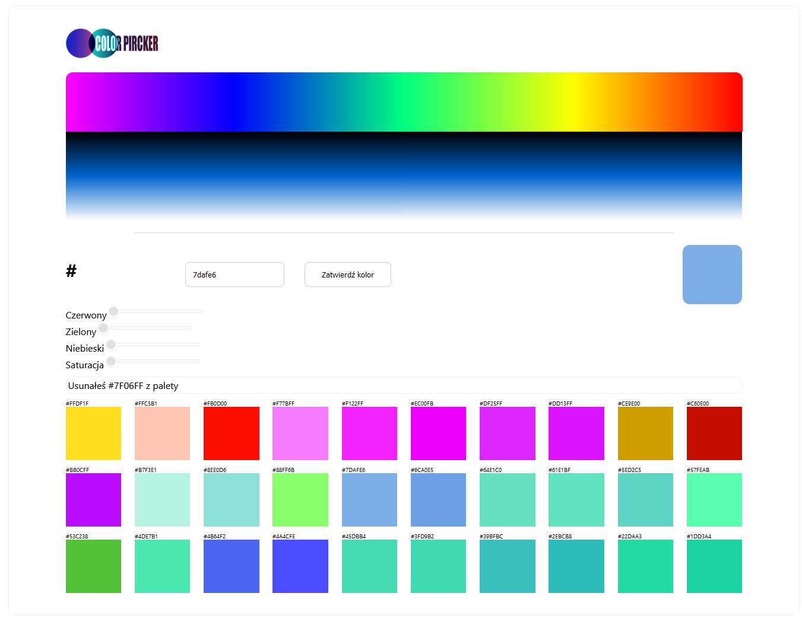

----------------------------------------

# Color Picker

### My first :rocket: React.TS application

-----------------------------------

### Color Selector App

This web application allows the user to select and parse colors, add them to a list, and filter them as desired. Colors can be selected from the top palette or entered manually into the input field.
Getting Started

##### To get started with the Color Selector App
``````
$ npm i
$ npm start
``````
simply navigate to the app's URL in your web browser. Once you're there, you'll see a color palette at the top of the page and an input field below it.

To select a color from the palette, simply click on the desired color. To enter a color manually, type the color's name or hex code into the input field and press the button.

Once you've selected or entered a color, it will be added to the list below the input field. You can add as many colors to the list as you like. 
You can delete each of them as well.

### Filtering Colors

To filter the list of colors, drag a range input to desired percentage of color. The list will be filtered in real-time as you type, showing only the colors that match the search term.
Parsing Colors

The Color Selector App automatically parses any color that is entered into the input field. If the color is entered as a name, the app will attempt to match it to a known color and display the corresponding hex code. If the color is entered as a hex code, the app will display the color's name (if available) and add it to the list.
Technologies Used

The Color Selector App was built using REACT.TS
